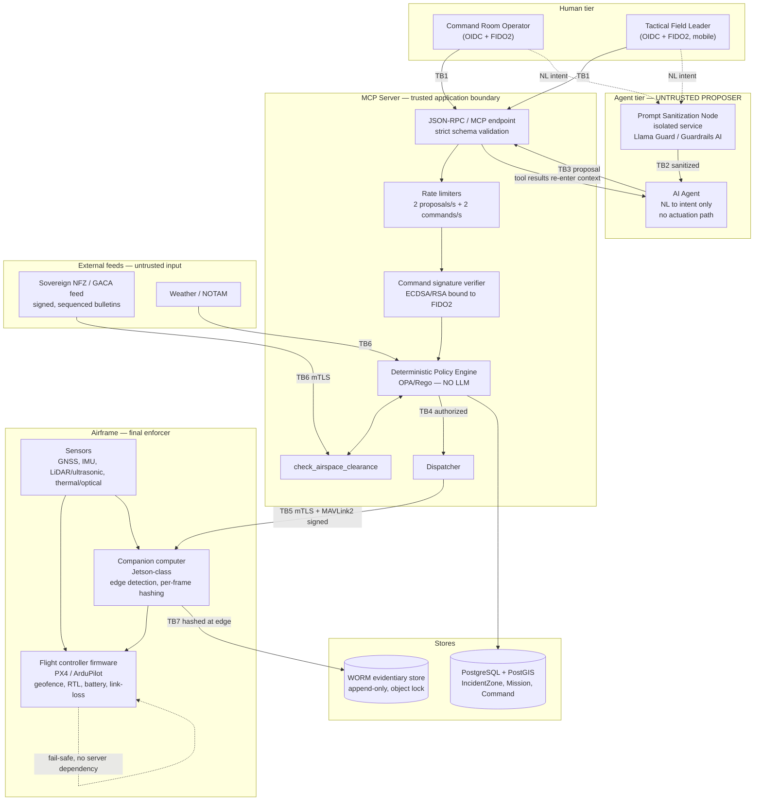

# STRIDE Threat Model — Agent → MCP → Hardware Chain

| | |
| --- | --- |
| **Document** | `docs/02-security-threat-model.md` |
| **Milestone** | 0, exit criterion 1 |
| **Status** | **DRAFT — awaiting security review sign-off** |
| **Method** | STRIDE per interaction, decomposed by trust boundary |
| **Governing standard** | Zero-Trust Adversarial Security Master Standard **v3.0-ULTRA** |
| **Source plan** | Tactical Drone Swarm & Recon MCP Server — Enterprise Production Plan v1.1 |
| **Scope** | The full chain from natural-language intent to physical actuation: operator → prompt sanitizer → AI agent → MCP server → policy engine → MAVLink/ROS2 → airframe, plus the NFZ/airspace feed and the evidentiary store |

Zero-Trust §11.1 makes a current STRIDE model a **release gate**: no deployment proceeds
without *"a documented STRIDE (or equivalent) threat model for any new trust boundary
introduced since the last release."* This document discharges that obligation for Milestone 0
and must be revisited whenever a boundary in §3 changes.

---

## 1. What makes this system different

Most threat models end at data loss. This one does not.

> **The blast radius of a successful attack here is kinetic.** An adversary who can inject a
> valid-looking command does not exfiltrate a record — they move a real aircraft over a real
> incident zone with real people under it.

Three consequences shape every judgement below:

1. **Confidentiality is not the top objective. Integrity of the command path and availability
   of the fail-safe path are.** An attacker who reads the thermal feed is a serious problem. An
   attacker who flies the drone is a different category of problem.
2. **Controls that depend on connectivity are not safety controls.** RF jamming is cheap and
   available to exactly the adversary who would want this platform blinded. Any mitigation whose
   correct operation requires reaching the MCP server has already failed in the scenario that
   matters most.
3. **The AI agent is part of the attack surface, not part of the defence.** Master Plan §4 and
   Zero-Trust §4.2 both classify it as an untrusted proposer. This document treats every agent
   output as attacker-influenced until deterministic code has validated it.

### 1.1 Security objectives, in priority order

| # | Objective | Failure looks like |
| --- | --- | --- |
| **O1** | No unauthorized physical actuation | An aircraft flies where no authorized human said it could |
| **O2** | The safety envelope holds under total system compromise | A server or agent compromise translates into a geofence or fail-safe breach |
| **O3** | Every command is attributable and non-repudiable | Post-incident review cannot establish who authorized what |
| **O4** | Airspace and NFZ decisions are never made on stale or forged data | A dispatch is cleared against data the authority has since revoked |
| **O5** | Evidentiary integrity from capture onward | Footage is inadmissible, or tampering is undetectable |
| **O6** | Confidentiality of the tactical picture | An adversary watches the feed and positions accordingly |
| **O7** | Bystander privacy and legal defensibility | Incidental capture becomes an uncontrolled disclosure |

---

## 2. System decomposition

### 2.1 Data-flow diagram

### 2.2 The two flows that matter most

**The authorization flow** runs left to right and is defended in depth: sanitizer → schema →
rate limit → signature → policy engine → clearance → dispatch. Each stage can only *narrow*
what proceeds.

**The fail-safe flow** is the dotted self-loop on `FCU`. It runs entirely inside the airframe on
local sensor data. It is deliberately drawn with no inbound edge from the server tier, because
that absence *is* the control.

---

## 3. Trust boundaries

| ID | Boundary | Crossing | Posture |
| --- | --- | --- | --- |
| **TB1** | Human ↔ MCP Server | Authenticated session | OIDC + FIDO2 hardware MFA; scoped per role **and** per `IncidentZone`; device posture attestation |
| **TB2** | Raw NL ↔ Agent context | Text into a model context window | Isolated sanitizer the agent cannot see or influence |
| **TB3** | Agent ↔ MCP Server | Tool-call proposal | **Untrusted proposer.** Minimum tool surface, capability token from real user permissions, 2 proposals/s |
| **TB4** | Policy engine ↔ Dispatch | Authorization decision | Deterministic non-LLM code; fail-closed; every decision logged |
| **TB5** | MCP Server ↔ Airframe | RF command/telemetry | mTLS + MAVLink2 signing + short-lived mission-scoped tokens. **Firmware is the final enforcer** |
| **TB6** | External feeds ↔ MCP Server | Airspace/NOTAM/weather data | Untrusted input: signature-verified, sequence-checked, freshness-bounded, strictly schema-validated |
| **TB7** | Capture ↔ Evidentiary store | Frames, telemetry, audit records | Hashed on edge hardware *before* transmission; WORM, append-only, no delete identity exists |
| **TB8** | Companion computer ↔ Flight controller | Onboard actuation request | Firmware enforces the envelope even against a compromised companion computer |

---

## 4. STRIDE analysis

Severity is the **realistic worst case assuming the stated controls are in place** —
`Critical` means a credible path to unauthorized physical actuation or a defeated fail-safe.

### 4.1 TB1 — Human ↔ MCP Server

| ID | S | Threat | Control | Residual | M |
| --- | --- | --- | --- | --- | --- |
| T-01 | **S** | Credential stuffing / phishing of an operator account to issue real missions | FIDO2/WebAuthn hardware MFA mandatory for tactical ops; SMS/email OTP forbidden (ZT §1.1); phishing-resistant by origin binding | Low | M1 |
| T-02 | **S** | Session hijack via stolen token replayed from another network | 10-min access tokens; refresh-family rotation with theft detection; JA3/JA4 + subnet binding (ZT §1.2) | Low-Med — fingerprint binding is advisory-strict; any downgrade needs a signed exception | M1 |
| T-03 | **T** | Operator's device compromised; commands issued by malware under a valid session | Device posture attestation before session issuance; mobile jailbreak/root and anti-hooking detection (ZT §1.3) | **Medium** — attestation raises cost, does not eliminate | M1 |
| T-04 | **R** | Operator denies having authorized a mission that caused harm | ECDSA/RSA non-repudiation token bound to the operator's FIDO2 key on **every** field command; unsigned commands rejected before the policy engine | Low | M1 |
| T-05 | **I** | Field leader's stolen handheld exposes the live tactical picture | Stream access time-boxed to the mission window, auto-revoked on mission close or zone expiry; per-`IncidentZone` scoping | Medium | M2 |
| T-06 | **D** | Auth-endpoint flooding locks out operators mid-incident | Per-account and per-IP adaptive rate limiting; **lockout state is itself rate-limited** to prevent lockout-as-DoS against a victim (ZT §1.1) | Low | M1 |
| T-07 | **E** | Field leader (Tier 2) cancels a Command Room (Tier 1) command | Cryptographic role precedence enforced at the policy engine, independent of timing or request order | Low | M1 |

### 4.2 TB2 — Raw NL ↔ Agent context · TB3 — Agent ↔ MCP Server

See the deep dive in §5.1; this table is the summary.

| ID | S | Threat | Control | Residual | M |
| --- | --- | --- | --- | --- | --- |
| T-08 | **S** | Agent output claims "command-room authorized" / "admin override" to obtain dispatch | Model output is **never** a credential. Deterministic gate ignores all natural-language claims of authority (ZT §4.2) | Low | M1 |
| T-09 | **T** | **Direct prompt injection**: operator input steers the agent outside the authorized boundary | Isolated sanitizer node before context entry; every proposal re-validated against the `IncidentZone` polygon | **Medium** — see §5.1 | M3 |
| T-10 | **T** | **Indirect prompt injection**: attacker-controlled text in a tool result, NFZ `designation`, or detection label re-enters context as instructions | Retrieved content labelled untrusted and treated as data; sanitizer screens **tool results too, not just user input**; content may not alter tool scope or envelope | **Medium-High** — largest open AI-layer risk; corpus does not yet exist (`TM-10`) | M3/M5 |
| T-11 | **R** | Agent proposes a harmful plan; no record of what it proposed vs. what was authorized | `Command` record stores the triple: raw NL + parsed intent + exact proposed payload + decision. **Rejected proposals are logged too** — a pattern of rejections is itself a security signal | Low | M1 |
| T-12 | **I** | Agent induced to exfiltrate context via a constructed URL or markdown image load | Output scanned for embedded secrets and outbound-URL construction; agent network access egress-proxied and logged (ZT §4.2) | Medium | M3 |
| T-13 | **D** | Runaway or adversarially-driven agent loop exhausts the MCP server | **2 proposals/second per session**, counted whether or not a proposal is approved — deliberately distinct from the 2 commands/s hardware limit | Low | M3 |
| T-14 | **E** | Agent obtains a tool it should not hold for the current mission | Capability token generated **server-side from the authenticated user's real permissions**, never from what the model requests; minimum tool surface exposed | Low-Med | M1 |
| T-15 | **E** | Agent proposal references a Tier 1/2 command ID to cancel or supersede it | Tier 3 cannot override any human command. Such an attempt is **rejected and logged as a security event**, not a benign conflict | Low | M1 |
| T-16 | **T** | Jailbreak of the agent also disables the filter meant to catch it | Sanitizer is a **separate service with its own deployment and update lifecycle**; the agent cannot introspect or influence its rules. This architectural separation is the control | Low-Med | M3 |

### 4.3 TB4 — Policy engine ↔ Dispatch

| ID | S | Threat | Control | Residual | M |
| --- | --- | --- | --- | --- | --- |
| T-17 | **T** | Per-mission override widens the altitude/velocity envelope | Envelope checked against **hard-coded constants independent of any per-mission override** (Master Plan §5); `SafetyEnvelope` is frozen and digest-pinned | Low | M0 ✅ |
| T-18 | **T** | Ambiguous NL maps to the wrong polygon; a wrong plan is dispatched unreviewed | Every plan rendered as a human-readable map overlay requiring explicit operator confirmation unless it exactly matches a pre-approved template | Medium — depends on the operator actually reading the overlay | M1 |
| T-19 | **D** | Policy engine unreachable; dispatch proceeds "temporarily" | **Default Deny.** No code path returns an authorization on an error. `check_clearance` cannot raise — every failure becomes a typed denial | Low | M0 ✅ |
| T-20 | **E** | Validation partially succeeds and a best-effort flight plan is emitted | Any validation failure returns a **structured rejection, never a partial plan** | Low | M0 ✅ |
| T-21 | **R** | Dispute over whether a dispatch was policy-approved | Append-only `Command` log with the full proposal/decision triple; WORM-shipped audit trail | Low | M1 |

### 4.4 TB5 — MCP Server ↔ Airframe

See the deep dives in §5.2 and §5.3.

| ID | S | Threat | Control | Residual | M |
| --- | --- | --- | --- | --- | --- |
| T-22 | **S** | **RF-adjacent attacker injects MAVLink commands** to move the aircraft | MAVLink2 message signing: per-link shared secret + monotonic timestamp/sequence; mTLS on every service hop; short-lived mission-scoped command tokens | Low-Med — depends on key distribution and secure-element custody | M1 |
| T-23 | **S** | Replay of a previously valid, validly-signed command | Monotonic sequence/timestamp in MAVLink2 signing; command tokens scoped to a single mission and short-lived | Low | M1 |
| T-24 | **T** | Firmware tampering installs a build with the geofence removed | Signed firmware images; secure boot verifies the chain; TPM/secure-element attests integrity **to the MCP server before the platform is admitted to a mission** | Low-Med | M1 |
| T-25 | **T** | Compromised companion computer commands the airframe outside the envelope | **TB8**: firmware enforces geofence/battery/link-loss independently of the companion computer — kinetic bounds have a `firmware` locus by construction, machine-checked | Low | M0 ✅ (design) / M1 (HIL) |
| T-26 | **I** | RF eavesdropping on the command/telemetry link reveals mission intent | Authenticated encryption on the C2/telemetry RF link where airframe and regulatory environment permit (ZT §4.3) | Medium — regulatory constraints may limit this | M2 |
| T-27 | **D** | **RF jamming** severs the link during an active mission | Loss of link is a **handled fail-safe trigger, not an unhandled state**: `LOST-LINK` forces `FAILSAFE` after `link_loss_grace_s`, executed onboard with no server round-trip. Modelled in `dronez/safety/states.py`: `LOST_LINK -> FAILSAFE` is a firmware transition, and no ground-commandable pair reaches either state | Low | M1 |
| T-28 | **D** | MCP server outage strands airborne drones | Fail-safe logic is edge-resident and duplicated; server runs active/active across AZs. **A server outage degrades capability, never safety.** Chaos test at M3 kills the server mid-mission; HIL-D-05 in [`07-degraded-landing-firmware-spec.md`](07-degraded-landing-firmware-spec.md) §8 is the hardware form of the same test | Low | M3 |
| T-29 | **T** | **GNSS spoofing** defeats geofence logic that trusts GNSS as ground truth | GNSS cross-validated against inertial dead-reckoning; divergence beyond `gnss_ins_divergence_max_m` sustained for `gnss_divergence_sustain_s` forces loiter/RTL. See §5.3 | **Medium** | M4 |
| T-30 | **D** | **Concurrent GNSS denial and vision loss** leaves no navigation source | `DEGRADED_VISUAL_INERTIAL_LANDING`: firmware-resident local vertical descent on ultrasonic/LiDAR alone. No dependency on server, policy engine, link, or agent. Fully specified in [`07-degraded-landing-firmware-spec.md`](07-degraded-landing-firmware-spec.md); the server-side half — *no ground path into or out of the state* — is implemented and machine-checked across the state cross-product | Medium — spec written, **all 18 HIL cases unexecuted** (`TM-27`) | M4 |
| T-30a | **T** | **Spoofer denies GNSS to force degraded landing, then "restores" a spoofed fix** so the aircraft resumes navigation on attacker-chosen coordinates — with its inertial reference already degraded past the point of cross-checking them | Sensor recovery **does not exit** `DEGRADED_VISUAL_INERTIAL_LANDING`. The descent continues to touchdown; recovered sensors improve the obstacle picture only. A landing on the wrong patch of ground is recoverable, an aircraft flown under adversarial guidance is not. Spec §4.3; HIL-D-09 | Low, if the firmware implements §4.3 as written | M4 |
| T-30b | **D** | **Ultrasonic/LiDAR arrays fail during a degraded landing**, leaving no guidance at all | Blind controlled descent at `degraded_descent_rate_mps` — the aircraft cannot hold altitude indefinitely, so the lowest-energy path to the ground is the least-bad option. Reported **distinctly** in telemetry, because the ground-safety implication for a security team differs sharply from a guided descent. Spec §7.3; HIL-D-11 | Medium — accepted, documented | M4 |
| T-31 | **E** | Memory-safety defect in a MAVLink/ROS2 parser gives code execution on the bridge | Parsers are native-code attack surface: continuous fuzzing + ASan/UBSan/MSan, **release-blocking** (ZT §9); memory-safe language preferred for new components | Medium until the fuzzing harness exists | M5 |

### 4.5 TB6 — External feeds ↔ MCP Server

**This boundary is implemented at Milestone 0.** Every control below is exercised by
`tests/adversarial/test_nfz_fail_closed.py`.

| ID | S | Threat | Control | Residual | M |
| --- | --- | --- | --- | --- | --- |
| T-32 | **S** | Forged NFZ bulletin from an attacker-controlled endpoint | HMAC/Ed25519 signature over canonical bytes; key resolved **only** through a known-key registry; `key_id` never used to build a path or URL | Low | M0 ✅ |
| T-33 | **S** | Bulletin impersonates a different issuing authority | Bulletin authority must match the authority bound to the verification key; every zone's authority must match the bulletin's | Low | M0 ✅ |
| T-34 | **T** | **A blocking restriction is silently removed in transit** — the highest-impact feed attack, because the result is an affirmative clearance over restricted airspace | Signature covers the whole body; a rejected bulletin leaves the cache **entirely unchanged**, so a tampered bulletin can neither add nor remove a restriction | Low | M0 ✅ |
| T-35 | **T** | Signature algorithm downgraded to `none` or a weaker primitive | Explicit allow-list checked **before** any comparison; the `algorithm` field *selects* a trusted verifier, never supplies one; `algorithm` and `key_id` are themselves inside the signed bytes | Low | M0 ✅ |
| T-36 | **S** | Replay of a genuine older bulletin to resurrect lifted restrictions or hide new ones | Strictly monotonic per-authority `sequence`; `valid_until_utc` enforced at apply time | Low | M0 ✅ |
| T-37 | **T** | Feed payload carries extra fields hoping for mass assignment (`override_safety_envelope`) | Undeclared fields cause outright rejection; unknown enum values fail closed rather than downgrading to "advisory" or "unrestricted" | Low | M0 ✅ |
| T-38 | **T** | Attacker-controlled free text in `designation`/`remarks` reaches the agent context as instructions | Marked untrusted in the contract; display-only, escaped at render; excluded from the audit projection. **Cross-reference T-10** — this is a live indirect-injection vector | Medium | M3 |
| T-39 | **D** | Feed unreachable or stale during an incident | **Fail closed.** No sync ⇒ `FEED_NEVER_SYNCED`; older than `nfz_max_staleness_s` ⇒ `FEED_STALE`. An empty cache is *"we do not know"*, never *"clear"* | Low — availability cost is accepted deliberately | M0 ✅ |
| T-40 | **D** | Oversized or malformed payload exhausts server resources | 8 MiB cap refused before parsing; bounded zones, rings, positions and string lengths | Low | M0 ✅ |
| T-41 | **E** | An affirmative clearance is minted early and replayed at dispatch | Clearance carries `nfz_clearance_validity_s` expiry; a denial carries **no** usable validity window | Low | M0 ✅ |
| T-42 | **T** | DNS rebinding / SSRF against the feed endpoint to redirect the sync | Egress proxy: resolve once, validate against the private/metadata/loopback block-list, connect to the **pinned IP**; redirects re-validated (ZT §3.3) | Open — transport not implemented (`TM-08`) | M1 |

### 4.6 TB7 — Evidentiary store

| ID | S | Threat | Control | Residual | M |
| --- | --- | --- | --- | --- | --- |
| T-43 | **T** | Footage altered after capture to change what an incident showed | Cryptographic hash computed **per frame on the edge hardware before transmission** — not on arrival. Evidentiary integrity therefore does not depend on trusting the network path or the receiving system. **Implemented** (`edge_node/frame_hasher.py`) | Low | M2 ✅ |
| T-43b | **T** | Footage **deleted or reordered** rather than altered — every remaining per-frame hash stays valid | Records are **chained**: each commits to its predecessor, so a gap breaks the linkage. Truncation of the tail needs the sealed head as an external anchor (`TM-25`) | Low-Med | M2 ✅ |
| T-44 | **T** | Administrator deletes inconvenient records | **No identity in the system, including administrators, holds delete or modify permission on committed records.** `WormSink` declares no delete or update method at all. Real resistance to a privileged attacker needs S3 Object Lock in compliance mode (`TM-22`) | Low-Med | M2 |
| T-45 | **R** | Chain of custody cannot be established in legal proceedings | `ChainOfCustodyRecord`: hash + timestamp + collecting system for every artifact, recorded in the immutable store at collection time | Low | M2 |
| T-46 | **I** | Bystanders incidentally captured; footage distributed beyond the tactical boundary | Redaction/blur pipeline runs before footage leaves the tactical/legal-hold boundary; documented retention and data-classification policy; compliance sign-off is a named stakeholder | **Medium** — process control as much as a technical one | M2 |
| T-47 | **I** | Thermal feed intercepted in transit | **Mandatory DTLS 1.3 / SRTP.** SDES, SHA-1 fingerprints, plaintext profiles and missing ICE are rejected at the signaling layer (`SdpGuard`). The DTLS version floor is enforced in the media engine, which SDP cannot express — no engine consumes it yet (`TM-23`) | Med until `TM-23` | M2 |
| T-47b | **T** | Ciphertext bits flipped in a non-AEAD SRTP profile, corrupting a thermal frame without the receiver noticing | AEAD profiles only (AES-GCM); `DtlsSrtpPolicy` refuses to be constructed with a non-AEAD profile | Low | M2 ✅ |
| T-47c | **D** | Link degraded or jammed to suppress a detection alert | Detection events are **never sheddable**: every tier including the floor carries them, and archival to WORM is unconditional at capture | Low | M2 ✅ |
| T-48 | **D** | Ransomware encrypts the evidentiary store | 3-2-1 backups with one offline/immutable/air-gapped copy; object-lock immutability ≥ maximum plausible intrusion dwell time; restore tested on a cadence | Low-Med | M5 |

### 4.7 Cross-cutting

| ID | S | Threat | Control | Residual | M |
| --- | --- | --- | --- | --- | --- |
| T-49 | **T** | Dependency confusion or a poisoned CI runner ships a build with a weakened envelope | Pinned lockfiles; internal names reserved; Sigstore signing + SLSA L3 provenance; ephemeral single-use runners that never see deployment secrets on fork PRs | Med — **runtime code is stdlib-only at M0, which is the strongest form of this mitigation** | M5 |
| T-50 | **I** | Secrets leak through logs | Log redactor strips authorization headers, tokens, session IDs and PII before stdout; GitLeaks/Trufflehog in pre-commit and pipeline | Low | M1 |
| T-51 | **I** | Timing oracle on signature comparison | `hmac.compare_digest` — constant-time — everywhere a secret is compared. `==` on a secret is a deployment-blocking finding (ZT §10) | Low | M0 ✅ |
| T-52 | **E** | A safety constant is quietly relaxed over time by successive changes | Digest of the envelope recorded in `CLAUDE.md` and asserted by test; every constant carries a recorded enforcement locus and rationale; kinetic bounds may not be server-only | Low | M0 ✅ |

---

## 5. Deep dives

### 5.1 Prompt injection and context poisoning

**Why this is the defining AI-layer risk.** The agent's whole job is to read attacker-reachable
text and turn it into structured proposals. There is no version of this system where the agent
does not process untrusted input — so the defence cannot be "keep untrusted text out". It has to
be "assume the agent is compromised and make that survivable."

#### Attack paths

| Path | Vector | Realistic entry point |
| --- | --- | --- |
| **Direct** | Operator or field-leader NL input | A coerced, careless, or malicious authenticated user |
| **Indirect — feed text** | `designation` / `remarks` on an NFZ zone | A compromised or malicious upstream feed (**T-38**) |
| **Indirect — tool results** | Any MCP tool result re-entering context | A detection label, a fleet-status string, an error message |
| **Indirect — sensor-adjacent** | OCR'd text or object labels from the thermal/optical pipeline | Physical text placed in the incident zone by an adversary |
| **Indirect — inter-agent** | Another agent's output consumed as input | Multi-agent scenarios from M3 onward |

#### The defence is layered, and only one layer is load-bearing

1. **Sanitizer node (isolated).** Screens all inbound NL *and all tool/RAG results* before
   context entry. Critically, it is a **separate service with its own deployment and update
   lifecycle** — the agent cannot introspect or influence its rules. A jailbreak of the agent
   therefore does not also compromise the filter meant to catch it (**T-16**).
2. **Role separation.** System prompts and tool definitions are structurally segregated from
   user/tool content via native message-role separation — **never string-concatenated into one
   field**.
3. **Untrusted labelling.** Retrieved content is explicitly labelled untrusted and may not alter
   tool scope, system prompt, or safety envelope for the remainder of the session.
4. **Least-privilege tool scoping.** The capability token comes from the authenticated user's
   real permissions, server-side. The model's opinion about what it needs is irrelevant.
5. **Rate limiting.** 2 proposals/second bounds a runaway loop (**T-13**).
6. **↯ The deterministic policy gate.** ← *This is the only layer that has to hold.*

> **The load-bearing assumption:** layers 1-5 are **defence in depth that will eventually fail**.
> Injection classifiers are probabilistic and adversaries iterate. The system is designed so that
> a **fully jailbroken agent still cannot cause unauthorized actuation**, because the policy
> engine re-validates every proposal against the pre-authorized `IncidentZone` and the hard
> safety envelope using non-LLM code, and anything outside that scope fails closed and requires
> fresh human authorization — never an agent re-interpretation.
>
> If a future change makes any layer above the gate load-bearing, that change is a design
> regression regardless of how well the classifier tests.

#### Output-side exfiltration (T-12)

The classic payoff for indirect injection is not actuation — it is data egress. Model output is
scanned before being surfaced or acted on, for embedded secrets and for constructed outbound
URLs or markdown image loads. Agent network access is egress-proxied and logged identically to
the SSRF controls in ZT §3.1/§3.3.

#### Open items

`TM-09` (sanitizer not deployed — required live from M3, ahead of any multi-agent scenario) and
`TM-10` (the adversarial corpus does not exist — a release-blocking gate per ZT §11.1). Until
`TM-10` closes, the residual risk on **T-10** is **Medium-High** and is the largest open AI-layer
risk in the system.

### 5.2 Command hijacking and spoofing

**Threat statement:** an adversary who can produce a command the airframe accepts can move a
real aircraft. This is the shortest path from "cyber" to "kinetic" in the entire design.

#### Layers an attacker must defeat, in order

| # | Layer | What it costs the attacker |
| --- | --- | --- |
| 1 | **Human authentication** | Must defeat FIDO2/WebAuthn — phishing-resistant, origin-bound, hardware-held |
| 2 | **Command signing** | Must produce an ECDSA/RSA token bound to a specific operator's FIDO2 key. **Unsigned or improperly-bound commands are rejected before the policy engine, not after** |
| 3 | **Role precedence** | Even a valid Tier 2 or Tier 3 identity cannot override a Tier 1 command |
| 4 | **Policy engine** | Must produce a command that is *also* inside the authorized `IncidentZone`, the hard envelope, and current airspace clearance |
| 5 | **Transport** | mTLS on every hop; short-lived, mission-scoped command tokens |
| 6 | **MAVLink2 signing** | Per-link shared secret with monotonic timestamp/sequence — defeats both injection and replay by an RF-adjacent attacker |
| 7 | **Firmware envelope** | Even a perfectly forged command cannot make the aircraft exceed a firmware-enforced geofence, altitude, or battery threshold |

Layer 7 is what makes the rest survivable. **The MCP server must never attempt to override
hardware emergency return commands** (ZT §4.1) — a server that *can* override the firmware
becomes a single point from which the entire safety envelope can be defeated, which is precisely
the design the standard forbids.

#### Non-repudiation

Every field command carries a short-lived signature bound to the issuing operator's hardware
key, and the `Command` record stores raw NL + parsed intent + exact payload + decision. This is
what allows a post-incident review to distinguish *"the agent proposed it"* from *"a human
authorized it"* — the distinction on which both operational learning and legal defensibility rest
(**T-04**, **T-11**, **T-21**).

#### The precedence matrix is a security control, not an ergonomics feature

A Tier 3 (agent) proposal that references or attempts to supersede a Tier 1/2 command identifier
is **rejected outright and logged with a policy-violation flag, treated as a security event**
(**T-15**). An agent attempting to cancel a human's command is either compromised or
malfunctioning; both warrant investigation, not a retry.

### 5.3 GPS spoofing and GNSS denial

**Threat statement:** geofencing that trusts GNSS as ground truth can be defeated by an attacker
who controls the position feed — and the failure is silent. The aircraft believes it is inside
the fence while it is physically outside it.

This is uniquely dangerous because it turns a *safety control into an attack instrument*: a
spoofer who convinces the drone it has drifted outside the fence can trigger an RTL, or worse,
walk the aircraft somewhere by feeding it a moving false position.

#### Detection

GNSS is never trusted as a sole source. The flight controller cross-validates the GNSS fix
against inertial dead-reckoning and, where available, a second independent positioning source.
Divergence beyond `gnss_ins_divergence_max_m` **sustained for** `gnss_divergence_sustain_s`
triggers a conservative fail-safe (loiter/RTL) rather than silent trust. Fix admissibility is
additionally bounded by `gnss_min_satellites` and `gnss_max_hdop`.

The sustain window matters in both directions: too short and ordinary multipath grounds the
fleet; too long and a spoofer gets a usable displacement budget. **Both values are unreviewed
engineering defaults** (`TM-03`) and are among the constants most in need of airframe-specific
calibration during the Milestone-0 review.

#### Response, and why RTL is not always the answer

A standard RTL still assumes the aircraft can navigate back to a launch point. Under GNSS denial
that assumption may be false. The design therefore separates two cases:

| Situation | Response | Depends on |
| --- | --- | --- |
| GNSS degraded, vision available | `execute_safe_return` — RTL, re-checking the geofence/hazard map en route; if the return path is compromised, controlled loiter/land-in-place rather than a risky return | Firmware + local sensing |
| GNSS **and** vision lost concurrently | **`DEGRADED_VISUAL_INERTIAL_LANDING`** — abandon waypoint navigation entirely; immediate local vertical descent at `degraded_descent_rate_mps` guided **solely** by ultrasonic/LiDAR obstacle-avoidance arrays | Firmware only |

`DEGRADED_VISUAL_INERTIAL_LANDING` **preempts** `execute_safe_return`; it is not one of its
trigger reasons. The two are mutually exclusive at any instant, and the firmware selects between
them on which sensors are actually available — not on anything the server or agent says.

Both paths are firmware-resident with **no dependency on the MCP server, the policy engine, link
availability, or any agent**, because the scenario in which they are needed is precisely the one
in which those may be unreachable.

#### Residual risk

**Medium.** Cross-validation raises the bar substantially but a sophisticated spoofer who ramps
the false position slowly enough to stay inside the divergence threshold remains a credible
threat. Validation is a Milestone-4 HIL gate, explicitly including the dual-failure scenario
landing safely under ultrasonic/LiDAR guidance alone.

---

## 6. Verification matrix

Threats already exercised by automated tests in this repository:

| Threat | Test |
| --- | --- |
| T-17, T-52 | `unit/test_safety_envelope.py::test_envelope_digest_matches_project_memory` |
| T-25 | `unit/test_safety_envelope.py::test_no_kinetic_bound_is_enforced_only_at_the_server` |
| §1.1 recon-only | `unit/test_safety_envelope.py::test_no_prohibited_capability_appears_as_a_tool_or_symbol` |
| T-19, T-20 | `adversarial/test_nfz_fail_closed.py::test_internal_error_becomes_a_denial_not_an_exception` |
| T-32, T-34 | `adversarial/test_nfz_fail_closed.py::test_tampered_bulletin_cannot_remove_a_restriction` |
| T-33 | `adversarial/test_nfz_fail_closed.py::test_cross_authority_bulletin_is_rejected` |
| T-35, T-51 | `adversarial/test_nfz_fail_closed.py::test_algorithm_downgrade_is_rejected_before_any_comparison` |
| T-36 | `adversarial/test_nfz_fail_closed.py::test_replay_of_an_earlier_bulletin_is_rejected` |
| T-37 | `contract/test_nfz_schema.py::test_undeclared_top_level_field_is_rejected` + `test_unknown_severity_is_rejected_not_downgraded` |
| T-39 | `adversarial/test_nfz_fail_closed.py::test_stale_feed_denies_even_though_the_cache_holds_clear_data` |
| T-40 | `adversarial/test_nfz_fail_closed.py::test_oversized_bulletin_is_refused_without_parsing` |
| T-41 | `adversarial/test_nfz_fail_closed.py::test_clearance_expires_and_cannot_be_replayed_at_dispatch` |
| All TB6 | `adversarial/test_nfz_fail_closed.py::test_no_fault_mode_yields_an_affirmative_clearance` |
| T-08, T-15 | `unit/test_schemas.py::test_agent_cannot_construct_a_signed_envelope` + `test_agent_can_never_override_anything` |
| T-09, T-10 | `adversarial/test_guardrails.py::test_indirect_injection_is_screened_on_every_inbound_channel` |
| T-12 | `adversarial/test_guardrails.py::test_agent_output_is_screened_for_exfiltration` |
| T-13 | `adversarial/test_guardrails.py::test_rejected_proposals_still_consume_the_budget` |
| T-14 | `unit/test_schemas.py::test_agent_cannot_be_scoped_to_human_only_tools` |
| T-16 | `adversarial/test_guardrails.py::test_classifier_unavailable_blocks` + the Llama Guard unparseable-verdict cases |
| T-17 | `unit/test_schemas.py::test_zone_cannot_widen_the_platform_envelope` + `test_envelope_bounds_are_enforced_at_the_type_level` |
| T-18 | `unit/test_schemas.py::test_accepted_proposal_always_requires_confirmation` |
| T-19 | `policy/test_policy_engine.py::test_every_failure_mode_denies` |
| T-20 | `unit/test_schemas.py::test_rejected_proposal_cannot_carry_a_partial_plan` |
| T-37 (schema) | `unit/test_schemas.py::test_undeclared_field_is_rejected` |
| T-41 | `policy/test_policy_bundle.py::test_clearance_policy_binds_the_decision_to_the_requested_volume` |
| T-43, T-47 | `unit/test_schemas.py::test_accepted_stream_must_declare_dtls_and_edge_hashing` |

**Not yet covered by automated tests:** TB5 and TB7 in full, and the cross-cutting set. Those
boundaries are specified but not implemented. Each becomes a release gate at its milestone per
ZT §11.1.

**Covered only structurally:** the Rego policies behind TB4 are checked for structure by
`policy/test_policy_bundle.py`, but have never been *executed* — see `TM-13`. Their semantic
verification is `scripts/verify_policies.sh`, which CI must run with `--require-opa`.

---

## 7. Open items register

Mirrored in `CLAUDE.md` §7. **Items marked "blocks Milestone-0 gate" must close before any
flight-capable code is written.**

| ID | Item | Disposition | Target |
| --- | --- | --- | --- |
| `TM-01` | `IncidentZone` model not finalized — the root authorization envelope is undefined | **Implemented**, awaiting review sign-off | M0 |
| `TM-02` | Policy-engine schema undefined | **Implemented** (Rego bundle), awaiting review and `opa test` | M0 |
| `TM-03` | Safety-envelope constants unreviewed; no named accountable owner | **Open — blocks M0 gate** | M0 |
| `TM-04` | NFZ channel has no live sovereign endpoint; only the mock is exercised | **Open — blocks M0 gate** | M0 |
| `TM-05` | `ed25519` signing allow-listed but not implemented | **Mitigated, fails closed** — an `ed25519` bulletin is rejected explicitly, never accepted unverified | M1 |
| `TM-06` | Planar geometry is an approximation | **Mitigated, conservative** — errs toward denial; PostGIS becomes authoritative | M1 |
| `TM-07` | Polygon self-intersection not detected | **Accepted for M0** — no flight code consumes it; `ST_IsValid` is the gate | M1 |
| `TM-08` | Transport (mTLS, pinning, egress proxy) not implemented — `NfzSyncChannel` is a seam only | **Open by design** — M0 scope is the protocol, not the socket | M1 |
| `TM-09` | Prompt-sanitization node not deployed | **Open** — live from M3, ahead of any multi-agent scenario | M3 |
| `TM-10` | Adversarial prompt-injection/jailbreak corpus does not exist | **Built and baselined** — 44 cases / 13 techniques / all 6 channels in `src/redteam/corpus.py`; 61.4% detection measured. Still open as a release gate until the sanitizer is deployed (`TM-09`) | M5 |
| `TM-11` | GACA registration and spectrum licensing not initiated | **Open — organizational, blocks M0 gate** | M0 |
| `TM-12` | No HIL rig; "server disconnected, fail-safe still works" cannot yet be tested | **Open** — the single most important test in the programme. The scenario now exists as `HIL-D-05`/`HIL-R-04` in `src/sitl_harness/`, executable the moment a rig does | M1 |
| `TM-13` | **The Rego bundle has never been executed** — `opa` is unavailable in the build environment (blocked by egress policy) | **Open — blocks M0 criterion 6.** Partially mitigated: an unloadable policy leaves the decision path undefined, which the client treats as a denial, so the failure mode is an outage rather than a bypass | M1 |
| `TM-14` | Command signature **verification** not implemented — the schema defines the shape, nothing checks the cryptography | **Closed** — `mcp_server/signing.py` verifies ES256/ES384/RS256/PS256 over canonical bytes covering the plan digest and the decision, bound to the operator's registered FIDO2 credential. `cryptography` is optional; absent, those algorithms are rejected rather than skipped | M1 ✅ |
| `TM-15` | No nonce store, so an exact replay inside the signature validity window is not rejected | **Closed** — `NonceStore`, TTL-bounded, consumed only *after* the signature verifies so a bad signature cannot burn a legitimate nonce | M1 ✅ |
| `TM-16` | Sanitizer heuristics are a fixed pattern list with no measured false-negative rate | **Measured** — 17 of 44 corpus cases missed (38.6%), each annotated with its root cause in `redteam.corpus`. Remains accepted and not load-bearing: every bypass is still refused at the MCP boundary | M5 |
| `TM-29` | **The sanitizer blocks legitimate operator traffic** — a genuine command-room relay matches the injection pattern (`BEN-003`) | **Open — fails the red-team gate.** Not fixed here: narrowing a validation rule to make a gate pass is what CLAUDE.md §10.5 forbids. A false positive mid-incident silences an operator, so this is a safety issue, not a nuisance | M2 |
| `TM-30` | **The heuristic screen is English-only while the UI is Arabic-first** (`INJ-090`, `INJ-091`, one of them on the sensor channel) | **Open.** Llama Guard is multilingual but is not deployed (`TM-09`), so nothing covers this in practice today | M3 |
| `TM-31` | The native-code fuzzing gate (Zero-Trust §9) has no target — there is no native code | **Open by design** — `scripts/fuzz_native.sh` reports NO TARGET and fails under `--require-native` rather than passing vacuously. The Python parsers that exist are fuzzed | M5 |
| `TM-17` | The identity provider is a static token resolver; real OIDC + JWKS verification and device-posture attestation are not implemented | **Open** — `PrincipalResolver` is the seam; the principal is already server-derived, so role and zone scoping cannot be set by a request | M1 |
| `TM-18` | The flight-plan staging store and nonce store are in-process, so single-use consumption does not hold across instances | **Open** — blocks HA/active-active | M3 |
| `TM-19` | MAVLink per-link signing secrets have no provisioning, rotation or revocation path | **Open** — the primitive is correct, the key lifecycle is not built | M1 |
| `TM-20` | The precedence arbiter derives a Tier-3 violation from the matrix rather than from the policy response | **Accepted** — deliberate: a security signal that disappears when the policy engine is down is not a signal | — |
| `TM-21` | **Privacy redaction pipeline is not built** | **Open — blocks the M2 gate.** Footage must not leave the tactical boundary until it exists | M2 |
| `TM-22` | The WORM store is in-process: no durability, no object lock | **Open** — S3 Object Lock in compliance mode is the real control | M2 |
| `TM-23` | `DtlsSrtpPolicy` is configuration no media engine consumes yet | **Open** — signaling checks are live; the DTLS version floor is not | M2 |
| `TM-24` | `SecureElementSigner` has no TPM-backed implementation | **Open** — `seal_segment` raises rather than pretending, so the failure is loud | M2 |
| `TM-25` | Chain truncation is undetectable from the records alone | **Accepted, documented** — auditors compare against the sealed head, not merely the records in hand | M2 |
| `TM-26` | **The emergency-stop channel is not actually independent** — the check is structural (same object, shared transport) and the default is an in-memory development channel | **Open — blocks the M4 gate.** Physical RF independence is a deployment property to verify on the rig, not a claim code can make. The default channel names itself distinctly in the audit log so a deployment running on it is obvious | M4 |
| `TM-27` | **The DVIL specification is unvalidated against hardware** — `degraded_descent_rate_mps` and `degraded_min_obstacle_clearance_m` are engineering defaults, and no airframe is selected | **Open.** [`07-degraded-landing-firmware-spec.md`](07-degraded-landing-firmware-spec.md) §8 lists the 18 HIL cases that close it; all 18 are unexecuted for want of a rig (`TM-12`). The server-side invariant is implemented and machine-checked | M4 |
| `TM-28` | Fleet registry and scheduler are in-process, so two instances could reserve the same airframe | **Open** — mitigated in one direction: `deploy_recon_waypoint` re-derives fleet facts at decision time, so a double reservation produces a denial rather than two dispatches | M3 |

---

## 8. Review and sign-off

This model is **draft**. Milestone-0 exit criterion 1 requires security review sign-off.

| Role | Name | Date | Status |
| --- | --- | --- | --- |
| Author | *(Principal Systems Architect / CISO role)* | 2026-09-14 | Drafted |
| Security review | *(unassigned)* | — | **Pending** |
| Accountable safety owner | *(unassigned — see `CLAUDE.md` §4.1)* | — | **Pending** |

**Revision triggers.** Re-open this document when: a trust boundary in §3 changes; a new MCP
tool is added; a safety constant changes (the `CLAUDE.md` digest will force the conversation); a
new external feed is integrated; any P1/P2 incident post-review produces a corrective action; or
a milestone security gate is reached.
